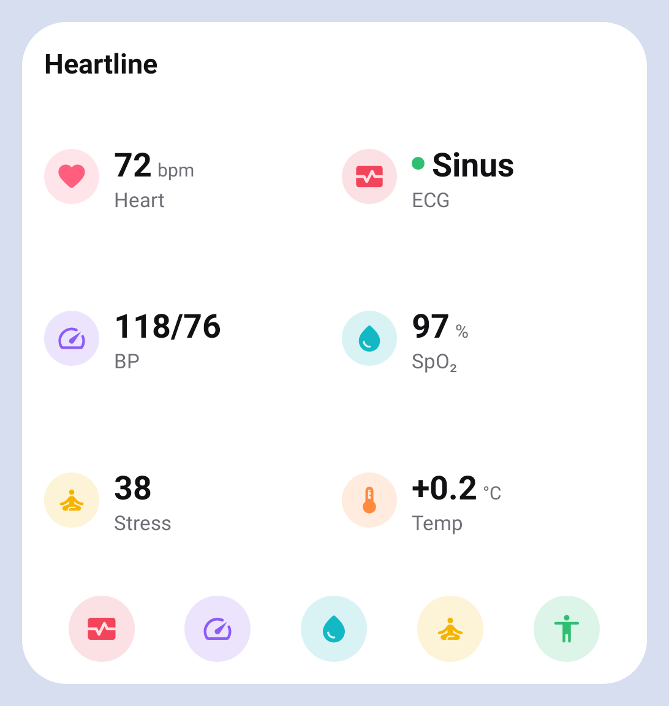
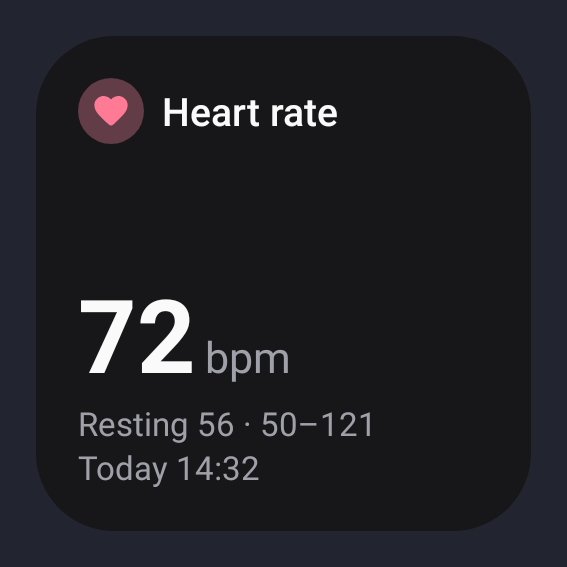
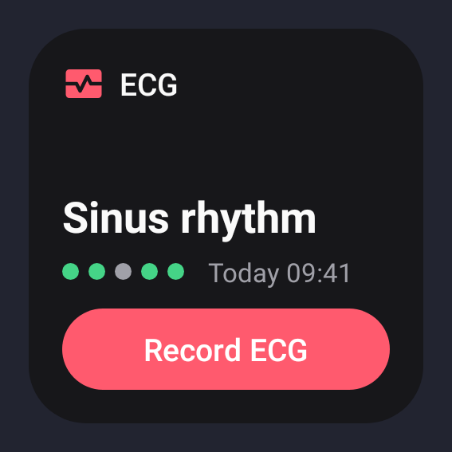
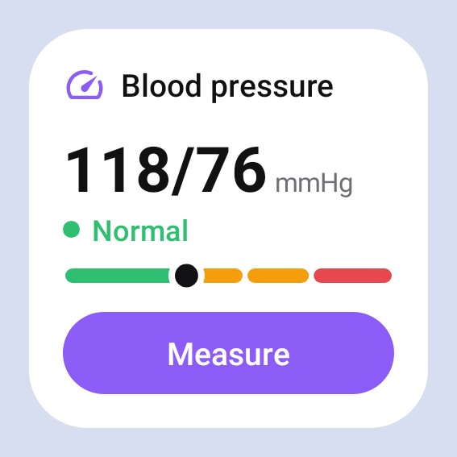
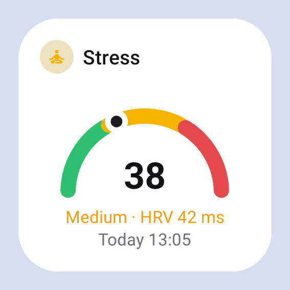
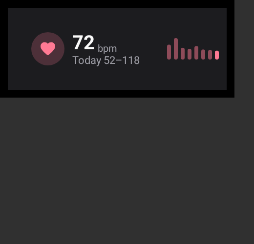
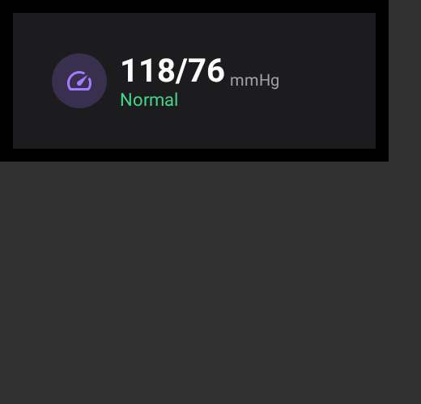
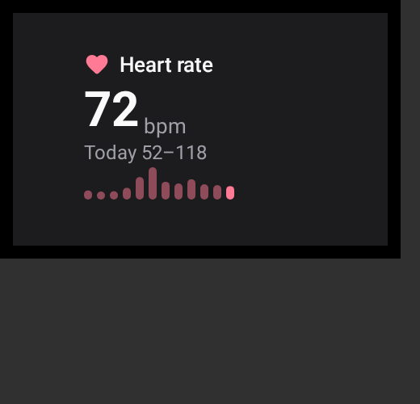
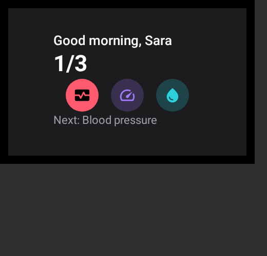

# Heartline

اپ سلامت قلب برای **Galaxy Watch** (Wear OS) و **گوشی Android** — هم‌تراز با Samsung Health Monitor، با زبان بصری One UI.
ماهیت: **wellness** (نه دستگاه پزشکی).

| قابلیت | ساعت | گوشی |
|---|---|---|
| ECG ۳۰ ثانیه + طبقه‌بندی ریتم (Sinus / Signs of AFib / High·Low HR / Inconclusive / Poor) | اندازه‌گیری، موج زنده، نتیجه | تاریخچه، موج روی کاغذ ECG، علائم، **PDF** |
| فشار خون با کالیبراسیون کاف (۳ ریدینگ، ۲۸ روز) | اندازه‌گیری PPG، دور کالیبراسیون | ویزارد کالیبراسیون، روند، میانگین‌ها، دسته‌بندی AHA |
| هشدار ریتم نامنظم (پس‌زمینه) + HR بالا/پایین | سرویس پایش، اعلان | تاریخچه‌ی هشدارها، تنظیمات |
| HR / HRV | HR زنده، Tile، Complication | نمودار روز، استراحت، HRV هفتگی |
| SpO2، دمای پوست، ترکیب بدن (BIA)، استرس (HRV + EDA) | اندازه‌گیری on-demand | جزئیات، روند، تاریخچه |
| خروجی | — | PDF و تصویر هر ECG، CSV همه‌ی داده‌ها، اشتراک با اپ‌های AI |
| ویجت / Tile / Complication | ۹ کارت برای صفحه‌ی tileها (کوچک و بزرگ؛ قلب، فشار، ECG، اکسیژن، استرس، ترکیب بدن، Today، Wellness، Measure) و ۱۳ complication | ویجت‌های One UI (داشبورد، Health tile ۱×۱ تا ۴×۲، دکمه‌ی Measure، ضربان، ECG، فشار، استرس، اندازه‌گیری روی ساعت، نمودار روز) و کاشی‌های Quick Settings |

اسکرین‌شات‌ها: [`docs/screenshots/`](docs/screenshots/README.md) (ویجت‌ها: [`widgets/`](docs/screenshots/widgets), کارت‌های ساعت: [`wear/cards/`](docs/screenshots/wear/cards)) · پلن: [`docs/MASTER_PLAN.md`](docs/MASTER_PLAN.md) · پروتکل: [`docs/PROTOCOL.md`](docs/PROTOCOL.md) · دیزاین: [`docs/DESIGN.md`](docs/DESIGN.md) · فشار خون: [`docs/BP_ALGORITHM.md`](docs/BP_ALGORITHM.md) · تست روی دستگاه: [`docs/DEVICE_TESTING.md`](docs/DEVICE_TESTING.md)

## ویجت‌ها

| داشبورد (4×4) | ضربان · ECG · فشار · استرس (2×2) | کارت‌های ساعت (کوچک و بزرگ) |
|---|---|---|
|  |     |     |

## ساختار
```
shared/     Kotlin JVM: مدل‌ها، پروتکل سینک، الگوریتم‌ها (ECG, HRV, IRN, BP, stress) — تست JVM
datalayer/  Android lib: SyncTransport روی Wearable Data Layer
phone/      اپ گوشی (Compose M3, Room, Koin)
wear/       اپ ساعت (Wear Compose M3, Samsung Health Sensor SDK 1.4.1, Wear widgets / Remote Compose)
```

## بیلد و تست
```bash
./gradlew :phone:assembleDebug :wear:assembleDebug   # APKهای دیباگ
./gradlew test                                        # JVM + Robolectric (+ اجرای Paparazzi)
./gradlew recordPaparazziDebug verifyPaparazziDebug   # اسکرین‌شات‌ها
./gradlew ktlintCheck
./gradlew :phone:assembleRelease :wear:assembleRelease   # R8
./gradlew -Pheartline.fakeSensors=true :wear:assembleDebug   # ساعت با سنسورهای مصنوعی (بدون Developer mode)
```
در سشن ابری Claude Code: `docs/CLOUD_SESSION.md` (پروکسی Gradle و آینه‌ی Maven Central).

## نصب روی دستگاه
1. GitHub → Actions → آخرین اجرای **Build** → Artifacts: `heartline-phone-debug` و `heartline-wear-debug`.
2. گوشی: `adb install -r phone-debug.apk`. ساعت (Wireless debugging): `adb connect IP:PORT && adb install -r wear-debug.apk`.
3. روی ساعت: Settings → Apps → **Health Sensor Service** → ۱۰ بار روی عنوان → **Developer mode** (تا ثبت Partner لازم است).
4. نسخه‌ی دیباگ گوشی بار اول داده‌ی نمایشی می‌سازد؛ با Settings → Delete all data پاک کنید.

هر دو APK با `keystore/debug.keystore` مشترک امضا می‌شوند (الزام Data Layer). جزئیات بررسی روی دستگاه: `docs/MASTER_PLAN.md` §8.
