# Phone · Measuring from the phone

The phone starts the measurement on the watch and follows it with the particle globe.

[← All screenshots](../../README.md)

| | Light | Dark |
|---|:-:|:-:|
| **Starting on the watch** | 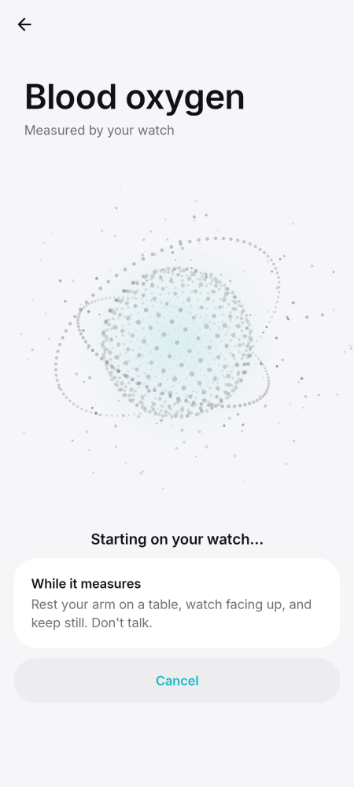 | 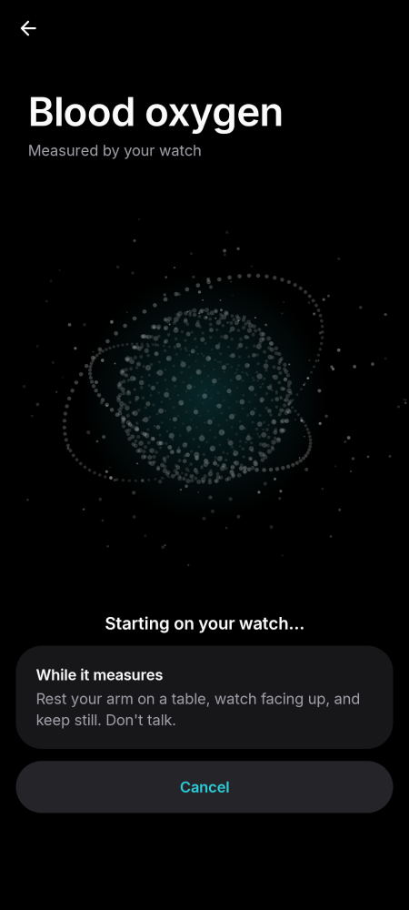 |
| **Blood oxygen: the globe lights up with the progress** | 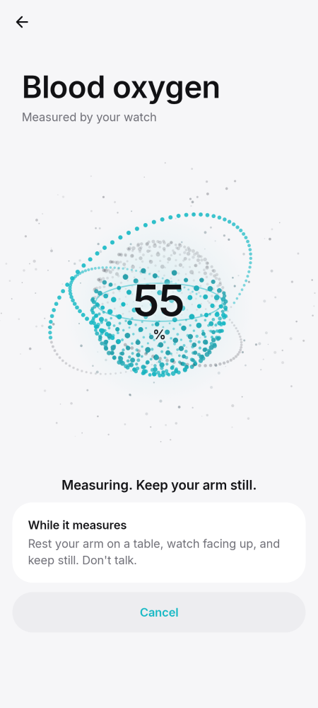 | 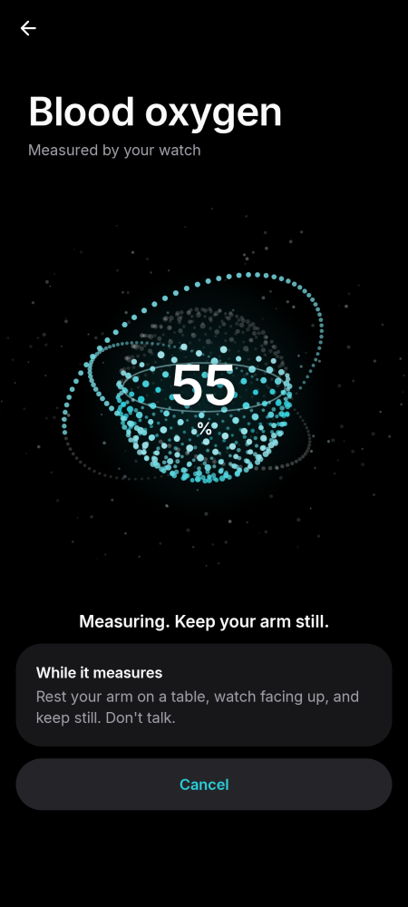 |
| **A hint from the watch: hold still** | 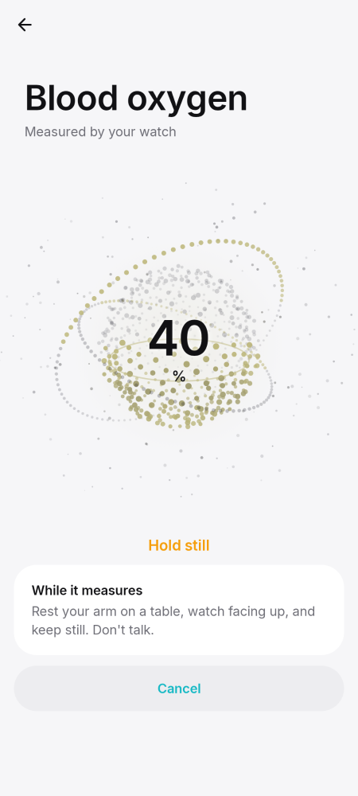 | 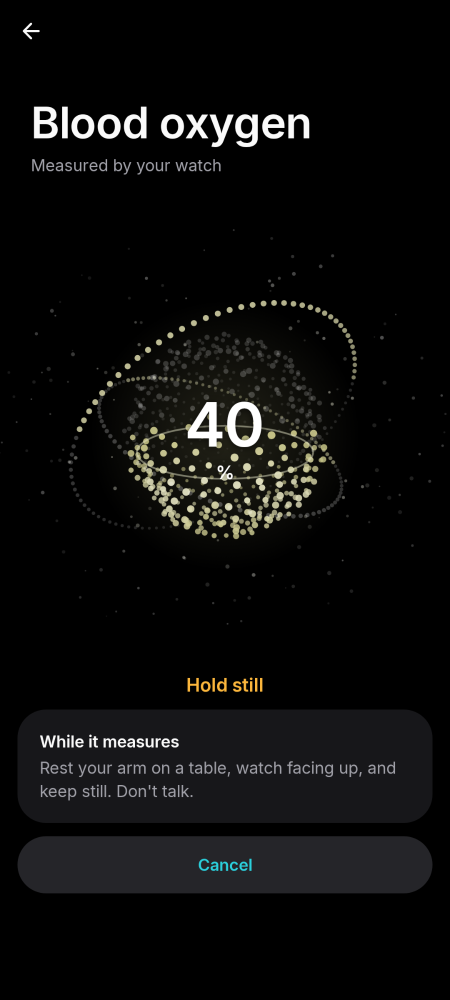 |
| **Heart rate: the globe beats with the live pulse** | 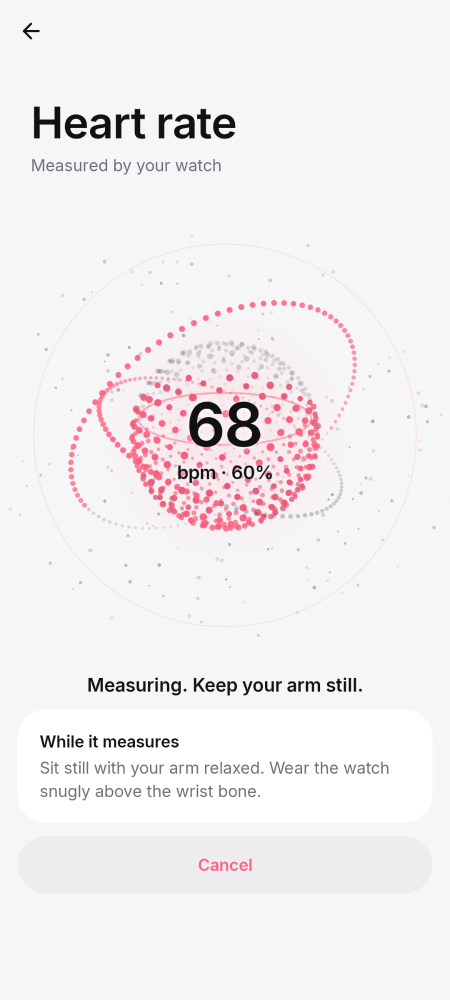 | 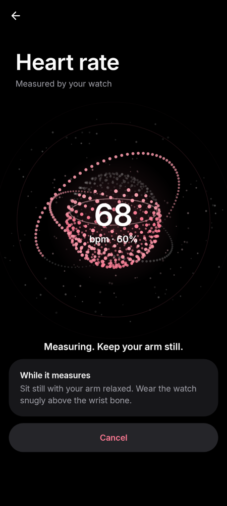 |
| **Stress: the globe breathes** | 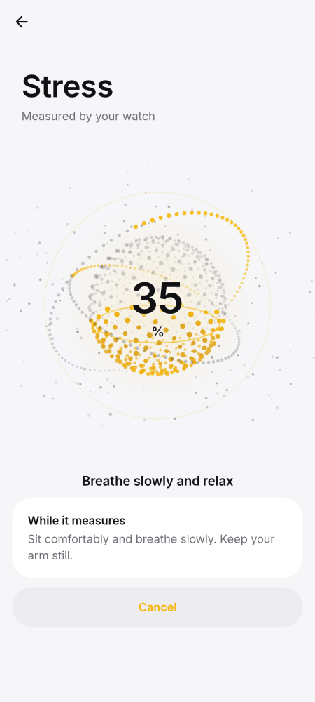 | 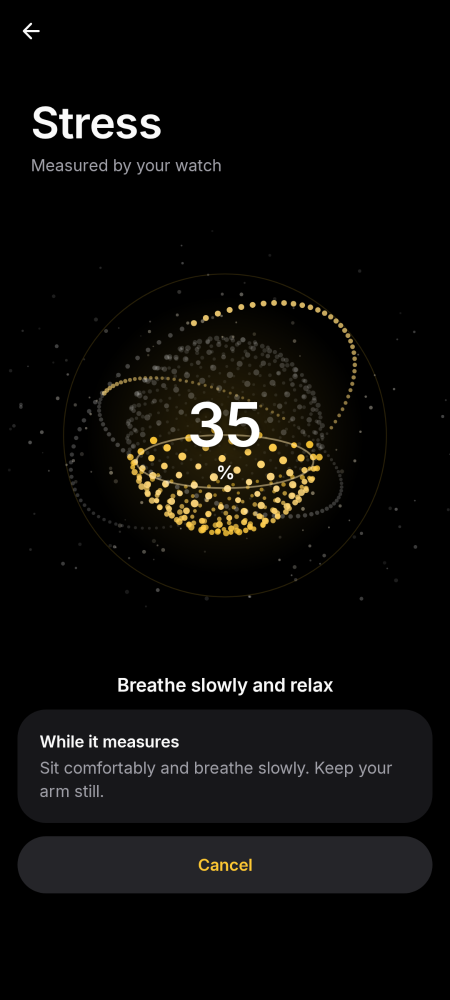 |
| **Skin temperature: the globe warms up** | 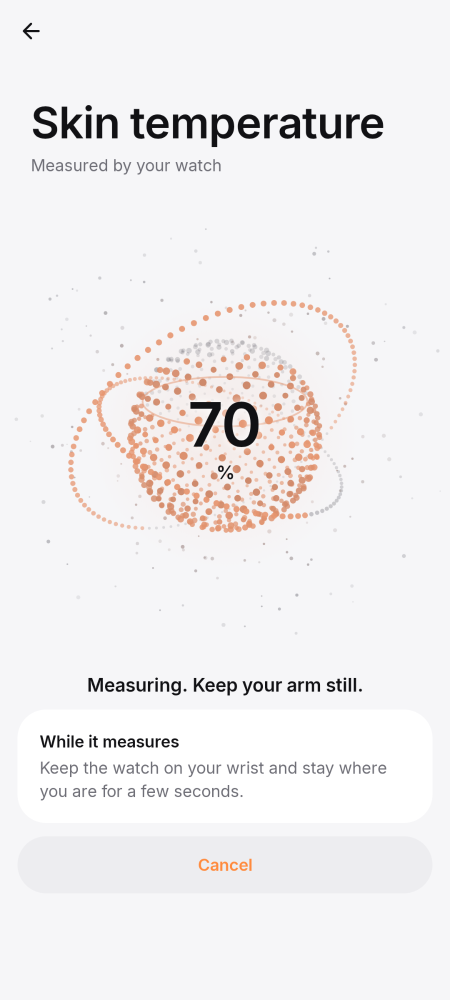 | 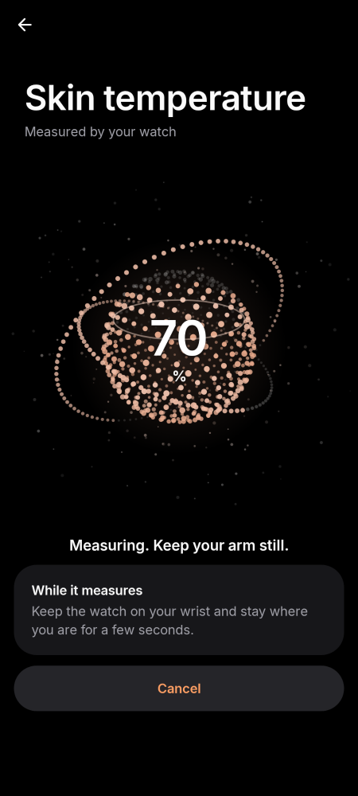 |
| **Blood pressure: the globe beats with the pulse** | 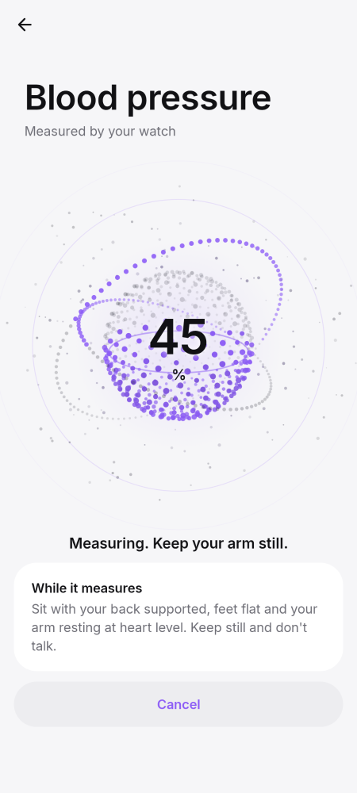 | 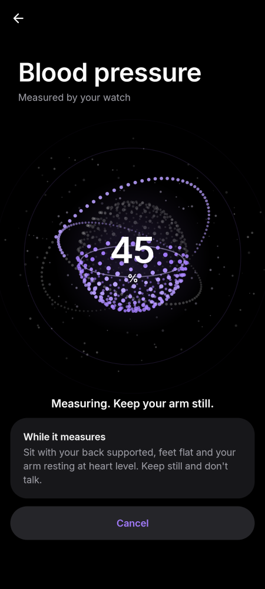 |
| **Heart rate check: result** | 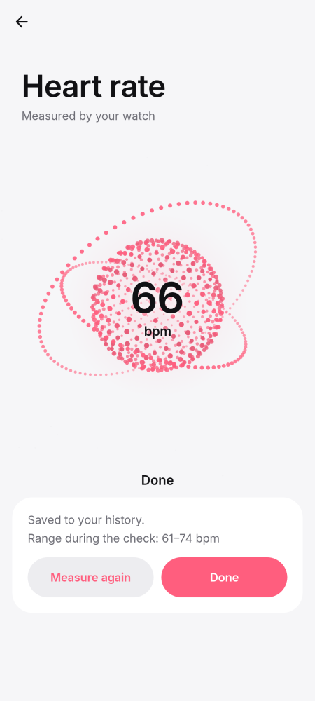 | 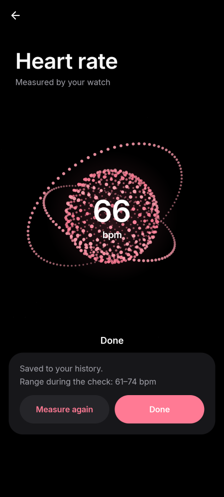 |
| **Blood pressure: result** | 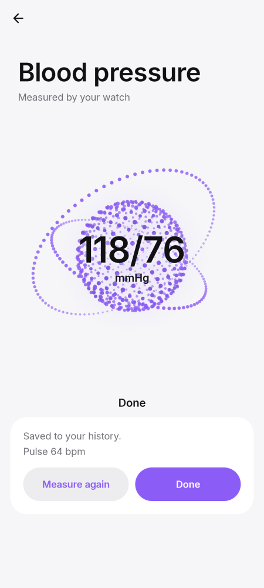 | 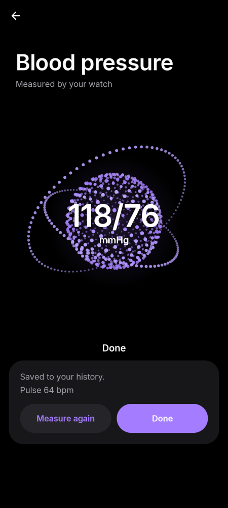 |
| **An older watch app: update it or measure on the watch** | 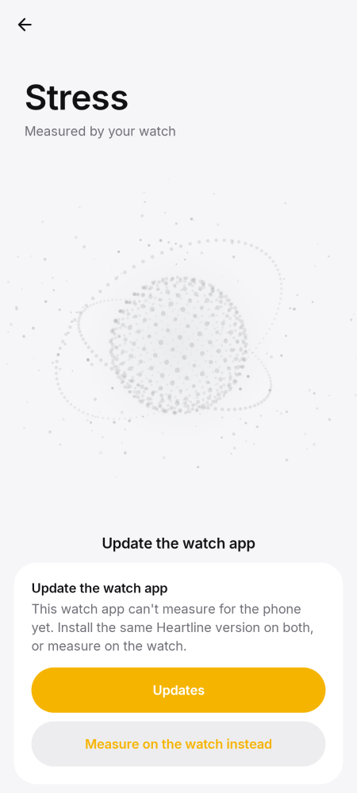 | 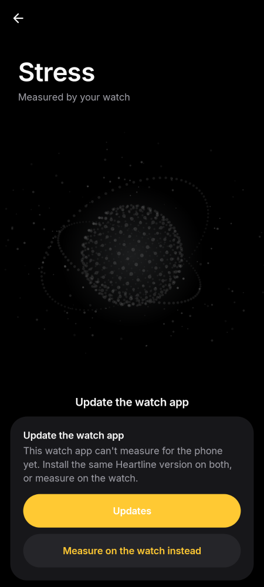 |
| **The arm moved: try again** | 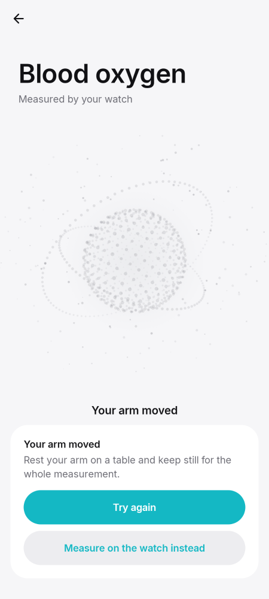 | 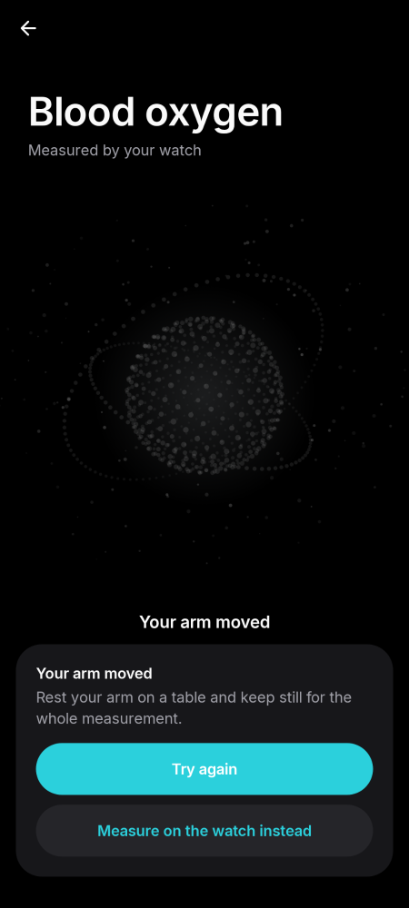 |
