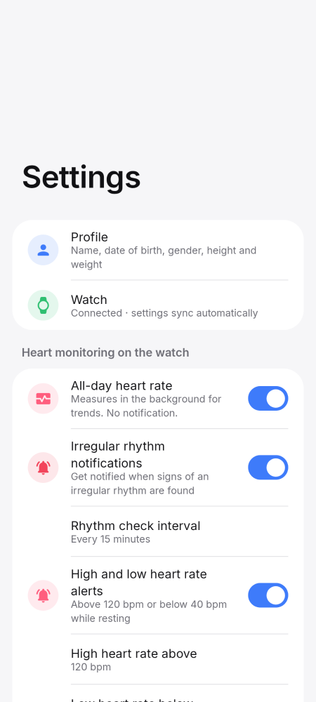
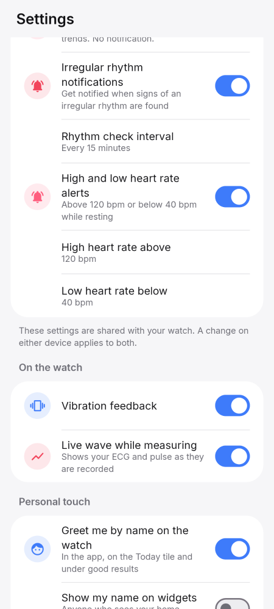
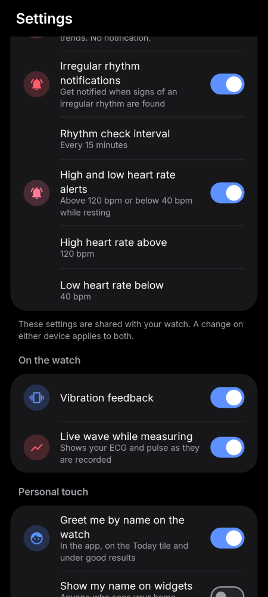
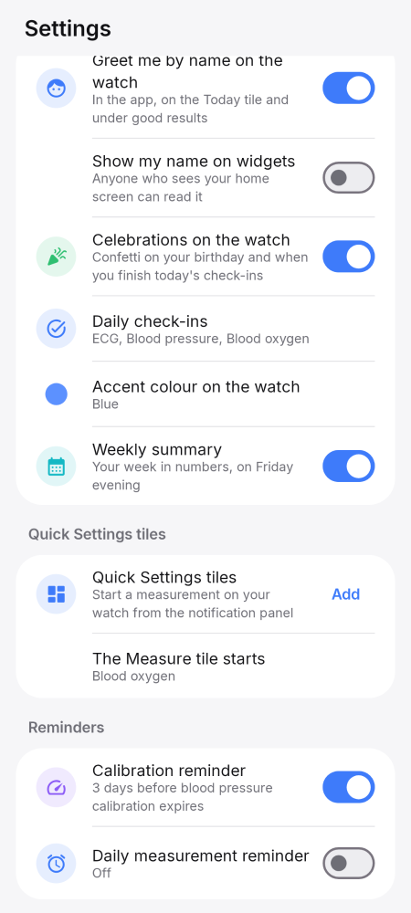
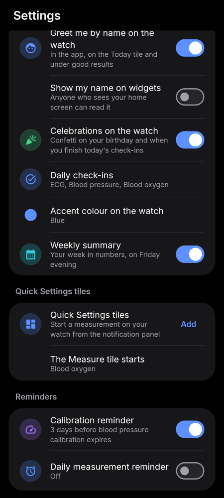
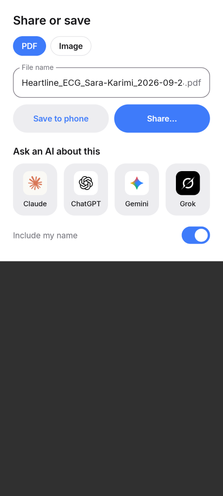
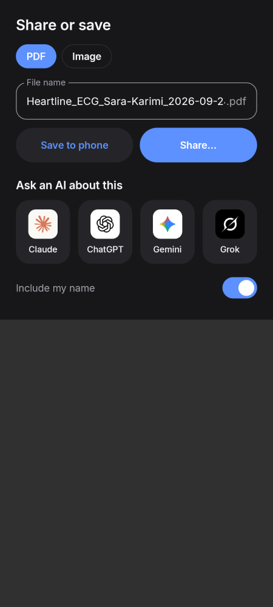
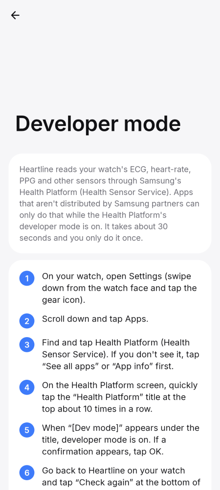
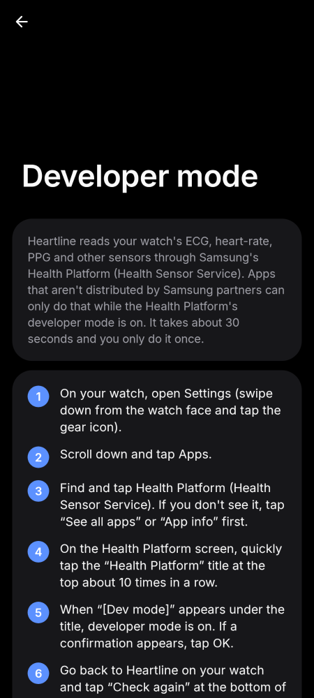
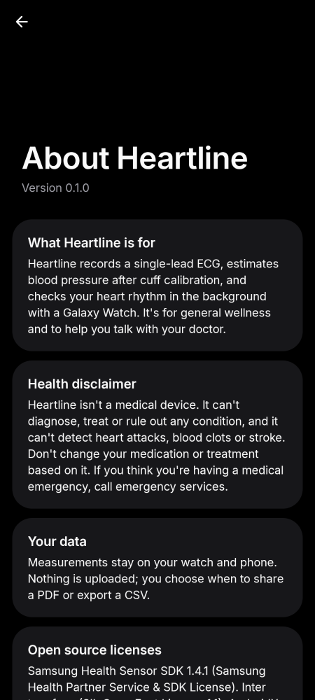

# Phone · Settings, updates and sharing

Settings, updates, what's new, sharing, help and about.

[← All screenshots](../../README.md)

| | Light | Dark |
|---|:-:|:-:|
| **Settings** |  |  |
| **Background monitoring** |  |  |
| **Sharing** |  |  |
| **Share a result, with AI apps** |  |  |
| **Share a result, no AI apps installed** |  |  |
| **Help: turning on developer mode on the watch** |  |  |
| **About** |  |  |
| **App icon** |  | — |
